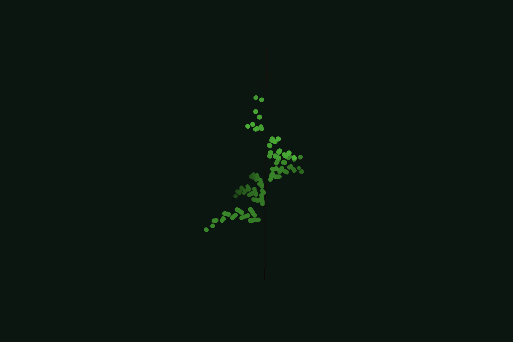

# Maidenhair

An interactive desktop application for exploring parametric
[L-system](https://en.wikipedia.org/wiki/L-system) plant models with real-time
3D visualisation and export to standard mesh formats. Named after *Adiantum
capillus-veneris*, the southern maidenhair fern.

Built with Python 3.13, [flet](https://flet.dev) (Flutter-backed cross-platform
UI), [moderngl](https://github.com/moderngl/moderngl) (GPU-accelerated
rendering), and [numpy](https://numpy.org).



## Quick Start

Requires Python >= 3.13 and [uv](https://docs.astral.sh/uv/).

```bash
uv sync                       # install dependencies
uv run maidenhair explore     # launch the interactive GUI
```

Or from the command line:

```bash
uv run maidenhair presets list                              # list available presets
uv run maidenhair render adiantum -n 7 -f png -o fern.png  # headless render to PNG
uv run maidenhair render sympodial_tree -f glb -o tree.glb # export to GLB mesh
```

## Features

- **Interactive 3D viewport** — orbit, zoom, and pan with the mouse. GPU-accelerated
  via OpenGL (moderngl) with 4x MSAA anti-aliasing, automatic fallback to PIL software
  rendering if no GPU is available.
- **Parametric L-systems** — supports symbols with numeric parameters like `F(2.5)`,
  `+(30)`, `!(0.8)`. Deterministic and stochastic production rules.
- **Fan-shaped leaf geometry** — leaves are rendered as oriented 3D fan/wedge shapes,
  not flat billboards. Proper depth testing and fog shading.
- **TOML preset files** — add new plants by dropping a `.toml` file in the presets
  directory. No Python required.
- **Mesh export** — OBJ, GLB, and PLY via trimesh. Each branch segment becomes a
  proper cylinder mesh.
- **Named colour palette** — presets use human-readable colour names like
  `"light-green"`, `"dark-bark"`, `"forest-night"` instead of raw RGB values.

## Bundled Presets

| Preset | Description | Default Iterations |
|--------|-------------|--------------------|
| `adiantum` | Southern maidenhair fern — tripinnate with fan-shaped pinnae | 7 |
| `fractal_plant` | Classic 2D branching plant (ABOP Figure 1.24f) | 3 |
| `monopodial_tree` | Tree with a single dominant trunk axis | 6 |
| `sympodial_tree` | Tree with branching at each node | 6 |

## Creating a Preset

Presets are TOML files in `src/maidenhair/presets/`. Here is a minimal example:

```toml
[meta]
name = "My Plant"
description = "A custom L-system plant"

[grammar]
axiom = "F"

[grammar.rules]
F = "FF+[+F-F-F]-[-F+F+F]"

[params]
step_length = 0.5
angle_default = 22.5
iterations_default = 4

[display]
leaf_color = "spring-green"
branch_color = "oak"
background_color = "forest-night"
```

### Grammar

The `axiom` is the starting string. Each key in `[grammar.rules]` maps a single
character to its replacement string. Rules are applied in parallel to every character
in the string for `n` iterations.

### Turtle Symbols

| Symbol | Action |
|--------|--------|
| `F(l)` | Move forward `l` units, draw a branch segment |
| `f(l)` | Move forward `l` units, no drawing (petiole) |
| `+(a)` / `-(a)` | Yaw left / right by `a` degrees |
| `&(a)` / `^(a)` | Pitch down / up by `a` degrees |
| `/(a)` / `\(a)` | Roll clockwise / counter-clockwise by `a` degrees |
| `[` / `]` | Push / pop turtle state (branching) |
| `!` | Reduce branch radius by `radius_ratio` |
| `~` | Emit a fan-shaped leaf at the current position |

If a symbol has no parenthesised parameter, the default values from `[params]`
are used (`step_length` for F/f, `angle_default` for rotations).

### Parameters

| Parameter | Description | Default |
|-----------|-------------|---------|
| `step_length` | Default forward distance for F/f | 1.0 |
| `angle_default` | Default rotation angle (degrees) | 25.0 |
| `radius_start` | Initial branch radius | 0.05 |
| `radius_ratio` | Radius multiplier on `!` | 0.75 |
| `tropism_weight` | Gravity bending strength (0 = none) | 0.0 |
| `iterations_default` | Default iteration count | 4 |
| `iterations_max` | Maximum allowed iterations | 7 |

### Colours

The `[display]` section accepts either named colours or RGB triples:

```toml
[display]
leaf_color = "light-green"          # named colour
branch_color = [110, 70, 35]       # explicit RGB
background_color = "forest-night"
```

Available named colours:

| Category | Names |
|----------|-------|
| Greens | `green`, `light-green`, `bright-green`, `dark-green`, `olive`, `fern-green`, `moss`, `spring-green` |
| Browns | `brown`, `dark-brown`, `light-brown`, `bark`, `dark-bark`, `walnut`, `oak`, `ebony` |
| Neutrals | `black`, `charcoal`, `slate`, `grey`, `light-grey`, `white` |
| Backgrounds | `forest-night`, `midnight`, `deep-green`, `parchment`, `cream` |
| Accents | `pink`, `red`, `yellow`, `orange`, `lavender` |

## CLI Reference

```
maidenhair render <preset> [OPTIONS]    Render a preset to file

  --iterations, -n   Number of derivation iterations
  --format, -f       Output format: png, obj, glb, ply
  --output, -o       Output file path
  --seed, -s         Random seed for stochastic rules
  --width            PNG render width (default 800)
  --height           PNG render height (default 600)

maidenhair presets list                 List available presets
maidenhair explore                     Launch the interactive GUI
```

## Architecture

Three strict layers with enforced import boundaries:

```
TOML preset
  -> PresetConfig.to_lsystem()
    -> LSystem.derive(n, seed=)
      -> parametric.tokenise()
        -> Turtle3D.interpret()
          -> Geometry (segments + leaves)
            -> GLViewport.render()    [GPU, interactive]
            -> MeshBuilder            [trimesh, export]
```

- **`core/`** — Pure logic. Grammar engine, parametric tokeniser, 3D turtle
  interpreter, preset loader. No UI or rendering imports.
- **`render/`** — Geometry to pixels (viewport) or meshes (trimesh). No flet
  imports. The GL viewport runs in a subprocess to avoid OpenGL context
  conflicts with flet's Flutter engine.
- **`ui/`** — Flet application. Sidebar controls, toolbar, canvas with
  gesture-based camera interaction.

Coordinate system: Y-up, right-handed. Turtle starts at origin facing +Y.
Gravity is -Y. All angles in presets are in degrees; conversion to radians
happens inside the turtle interpreter.

## Development

```bash
uv sync                              # install dependencies
uv run pytest tests/ -v              # run tests
uv run ruff check src/ tests/        # lint
uv run ty check src/                 # type check
uv run pre-commit run --all-files    # all hooks

just test                            # run tests via justfile
just lint                            # ruff + ty
just dev                             # flet hot-reload mode
```

## References

- Prusinkiewicz & Lindenmayer, *The Algorithmic Beauty of Plants* (1990)
  — freely available at [algorithmicbotany.org](https://algorithmicbotany.org/papers/abop/abop.pdf)
- Hanan, *Parametric L-systems and their application to the modelling
  and visualization of plants* (1992)
- See `research/resources.md` for a full list of references and PDFs.

## Licence

MIT
