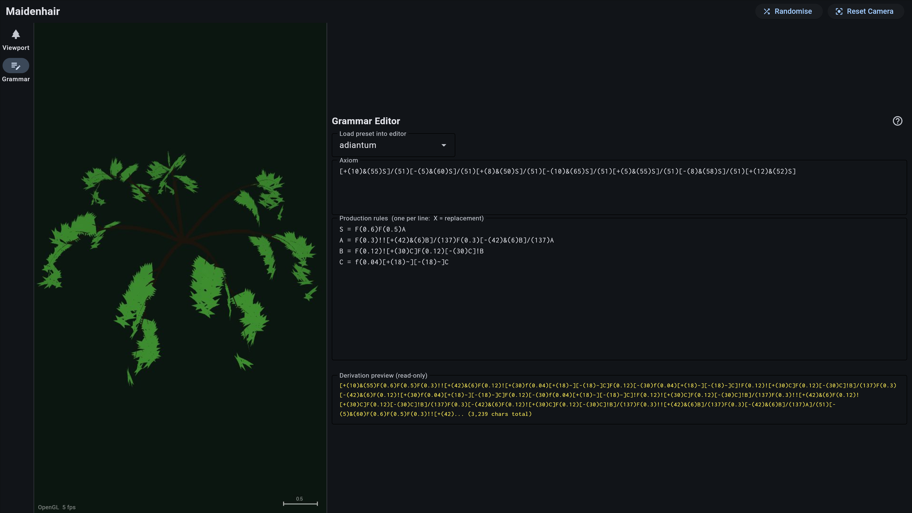
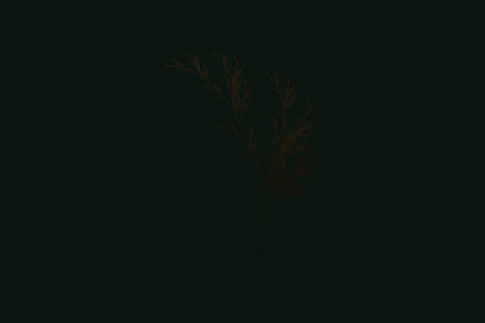
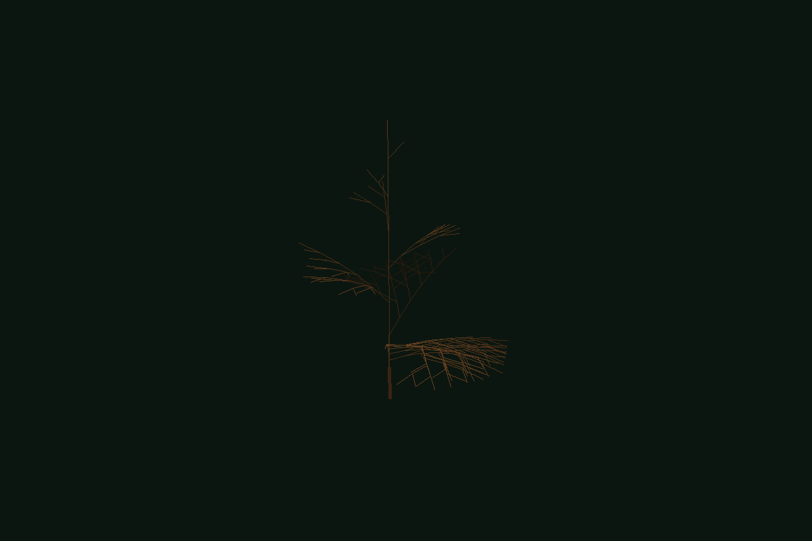

# Maidenhair

An interactive desktop application for exploring parametric
[L-system](https://en.wikipedia.org/wiki/L-system) plant models with real-time
3D visualisation and export to standard mesh formats. Named after *Adiantum
raddianum*, the delta maidenhair fern.

Built with Python 3.13, [flet](https://flet.dev) (Flutter-backed cross-platform
UI), [moderngl](https://github.com/moderngl/moderngl) (GPU-accelerated
rendering), and [numpy](https://numpy.org).



## Quick Start

Requires Python >= 3.13 and [uv](https://docs.astral.sh/uv/).

```bash
uv sync                       # install dependencies
uv run maidenhair explore     # launch the interactive GUI
```

Or from the command line:

```bash
uv run maidenhair presets list                                  # list all 28 presets
uv run maidenhair render adiantum -n 7 -f png -o fern.png      # render to PNG
uv run maidenhair render honda_tree_a -n 8 -f glb -o tree.glb  # export to GLB mesh
```

## Features

- **Interactive 3D viewport** — orbit, zoom, and pan with the mouse.
  GPU-accelerated via OpenGL (moderngl) with 4x MSAA anti-aliasing.
  Automatic fallback to PIL software rendering when no GPU is available.
- **Live grammar editor** — edit axioms and production rules with instant
  visual feedback. Built-in L-systems reference manual accessible via the
  **?** button.
- **28 bundled presets** — ferns, bushes, trees, inflorescences, and algae
  sourced from ABOP (Prusinkiewicz & Lindenmayer) and Paul Bourke's
  collection.
- **Parametric L-systems** — symbols with numeric parameters like `F(2.5)`,
  `+(30)`, `!(0.8)`. Deterministic and stochastic production rules.
- **Fan-shaped leaves** — leaf geometry rendered as oriented 3D fan/wedge
  shapes with proper depth testing and fog shading.
- **TOML preset files** — add new plants by dropping a `.toml` file in the
  presets directory. Named colour palette for readable display config.
- **Mesh export** — OBJ, GLB, and PLY via trimesh. Each branch becomes a
  cylinder mesh.

## The GUI

The application has two modes, accessed via the navigation rail on the left:

**Viewport mode** — 3D canvas with a parameter sidebar. Select presets,
adjust geometry parameters (step length, angle, radius, tropism) with
sliders, change display colours, and export to file.

**Grammar mode** — full-screen L-system editor alongside the 3D canvas.
Load any preset into the editor, modify axioms and rules, and see the
result rendered live. A derivation preview shows the first 500 characters
of the expanded string. The **?** button opens the built-in L-systems
reference manual.


## Bundled Presets

### Ferns & compound leaves

| Preset        | Description                                                       | Source     |
|---------------|-------------------------------------------------------------------|------------|
| `adiantum`    | *Adiantum raddianum* — bushy clump of 7 arching tripinnate fronds | Custom     |
| `fern_abop_e` | Symmetric fern (node-rewriting)                                   | ABOP 1.24e |
| `fern_abop_f` | Asymmetric fern — most naturalistic 2D plant                      | ABOP 1.24f |



### Trees

| Preset             | Description                            | Source    |
|--------------------|----------------------------------------|-----------|
| `honda_tree_a`     | Monopodial — r2=0.6, wide crown        | ABOP 2.6a |
| `honda_tree_b`     | Monopodial — r2=0.9, dense             | ABOP 2.6b |
| `honda_tree_c`     | Monopodial — r2=0.8, balanced          | ABOP 2.6c |
| `honda_tree_d`     | Monopodial — a2=-30, drooping laterals | ABOP 2.6d |
| `sympodial_tree_a` | Sympodial — a1=10 a2=60, narrow        | ABOP 2.7a |
| `sympodial_tree_b` | Sympodial — a1=5 a2=65, columnar       | ABOP 2.7b |
| `sympodial_tree_c` | Sympodial — a1=20 a2=50, spreading     | ABOP 2.7c |
| `sympodial_tree_d` | Sympodial — a1=35 a2=35, symmetric     | ABOP 2.7d |
| `ternary_tree_a`   | Three-way branching, d1=94.7           | ABOP 2.8a |
| `ternary_tree_b`   | Three-way, golden angle spacing        | ABOP 2.8b |
| `ternary_tree_c`   | Three-way, wide spread                 | ABOP 2.8c |
| `weeping_tree`     | Three-way with strong tropism          | ABOP 2.8d |



### Bushes & herbs

| Preset         | Description                    | Source       |
|----------------|--------------------------------|--------------|
| `abop_plant_a` | Edge-rewriting, 25.7°          | ABOP 1.24a   |
| `abop_plant_b` | Edge-rewriting, 20°            | ABOP 1.24b   |
| `abop_plant_c` | Edge-rewriting, 22.5°          | ABOP 1.24c   |
| `bush_3d`      | 3D bush with fan-shaped leaves | ABOP 1.25    |
| `bush_a`       | Opposing triple-F branches     | Bourke       |
| `bush_c`       | Dense five-branch bush         | Bourke       |
| `bush_d_saupe` | Multi-variable complex bush    | Bourke/Saupe |
| `sticks`       | Alternating branch sticks      | ABOP 1.24d   |
| `weed`         | Paired-branch weed             | Bourke       |

### Inflorescences

| Preset    | Description                                | Source     |
|-----------|--------------------------------------------|------------|
| `raceme`  | Flower spike with golden-angle phyllotaxis | ABOP 3.3.1 |
| `panicle` | Compound branching flower clusters         | ABOP 3.3.1 |
| `cyme`    | Sympodial branching flower head            | ABOP 3.3.2 |

### Algae

| Preset    | Description                     | Source |
|-----------|---------------------------------|--------|
| `algae_a` | 18-rule complex branching algae | Bourke |

## Creating a Preset

Presets are TOML files in `src/maidenhair/presets/`. Here is a minimal example:

```toml
[meta]
name = "My Plant"
description = "A custom L-system plant"

[grammar]
axiom = "F"

[grammar.rules]
F = "FF+[+F-F-F]-[-F+F+F]"

[params]
step_length = 0.5
angle_default = 22.5
iterations_default = 4

[display]
leaf_color = "spring-green"
branch_color = "oak"
background_color = "forest-night"
```

### Turtle Symbols

| Symbol | Action |
|--------|--------|
| `F(l)` | Move forward `l` units, draw a branch segment |
| `f(l)` | Move forward `l` units, no drawing (petiole) |
| `+(a)` / `-(a)` | Yaw left / right by `a` degrees |
| `&(a)` / `^(a)` | Pitch down / up by `a` degrees |
| `/(a)` / `\(a)` | Roll clockwise / counter-clockwise by `a` degrees |
| `[` / `]` | Push / pop turtle state (branching) |
| `$` | Roll to vertical — align left vector with horizontal plane |
| `!` | Reduce branch radius by `radius_ratio` |
| `~` | Emit a fan-shaped leaf at the current position |

If a symbol has no parenthesised parameter, the default values from `[params]`
are used. `step_length` acts as a scale factor — `F(0.5)` moves
`0.5 * step_length` units, so the slider always has visible effect.

### Parameters

| Parameter | Description | Default |
|-----------|-------------|---------|
| `step_length` | Scale factor for all forward movement | 1.0 |
| `angle_default` | Default rotation angle (degrees) | 25.0 |
| `radius_start` | Initial branch radius | 0.05 |
| `radius_ratio` | Radius multiplier on `!` | 0.75 |
| `tropism_weight` | Gravity bending strength (0 = none) | 0.0 |
| `iterations_default` | Default iteration count | 4 |
| `iterations_max` | Maximum allowed iterations | 7 |

### Colours

The `[display]` section accepts either named colours or RGB triples:

```toml
[display]
leaf_color = "light-green"          # named colour
branch_color = [110, 70, 35]       # explicit RGB
background_color = "forest-night"
```

Available named colours:

| Category | Names |
|----------|-------|
| Greens | `green`, `light-green`, `bright-green`, `dark-green`, `olive`, `fern-green`, `moss`, `spring-green` |
| Browns | `brown`, `dark-brown`, `light-brown`, `bark`, `dark-bark`, `walnut`, `oak`, `ebony` |
| Neutrals | `black`, `charcoal`, `slate`, `grey`, `light-grey`, `white` |
| Backgrounds | `forest-night`, `midnight`, `deep-green`, `parchment`, `cream` |
| Accents | `pink`, `red`, `yellow`, `orange`, `lavender` |

## CLI Reference

```
maidenhair render <preset> [OPTIONS]    Render a preset to file

  --iterations, -n   Number of derivation iterations
  --format, -f       Output format: png, obj, glb, ply
  --output, -o       Output file path
  --seed, -s         Random seed for stochastic rules
  --width            PNG render width (default 800)
  --height           PNG render height (default 600)

maidenhair presets list                 List available presets
maidenhair explore                     Launch the interactive GUI
```

## Architecture

Three strict layers with enforced import boundaries:

```
TOML preset
  -> PresetConfig.to_lsystem()
    -> LSystem.derive(n, seed=)
      -> parametric.tokenise()
        -> Turtle3D.interpret()
          -> Geometry (segments + leaves)
            -> GLViewport.render()    [GPU, interactive]
            -> Viewport.render()      [PIL, fallback]
            -> MeshBuilder            [trimesh, export]
```

- **`core/`** — Pure logic. Grammar engine, parametric tokeniser, 3D turtle
  interpreter, preset loader, named colour palette. No UI or rendering
  imports.
- **`render/`** — Geometry to pixels or meshes. The GL viewport runs in a
  child process to avoid OpenGL context conflicts with flet's Flutter
  engine. PIL software viewport as fallback. Trimesh mesh builder for
  OBJ/GLB/PLY export.
- **`ui/`** — Flet application. Navigation rail with viewport and grammar
  editor pages. Sidebar with parameter sliders and colour pickers.
  Canvas with mouse orbit/zoom and FPS display.
- **`help/`** — Bundled L-systems reference manual (Markdown), loaded via
  `importlib.resources` and rendered in the grammar editor's help dialog.

Coordinate system: Y-up, right-handed. Turtle starts at origin facing +Y.
Gravity is -Y. All angles in presets are in degrees; conversion to radians
happens inside the turtle interpreter.

## Development

```bash
uv sync                              # install dependencies
uv run pytest tests/ -v              # run tests (44 tests)
uv run ruff check src/ tests/        # lint
uv run ty check src/                 # type check
uv run pre-commit run --all-files    # all hooks

just test                            # run tests via justfile
just lint                            # ruff + ty
just dev                             # flet hot-reload mode
```

## Research

The `research/` directory contains reference material:

- `resources.md` — annotated bibliography with links to all sources
- `l-systems.md` — copy of the in-app L-systems primer (also shipped
  as `src/maidenhair/help/l-systems-help.md`)
- `webgl-plan.md` — plan for client-side WebGL rendering
- PDFs from [algorithmicbotany.org](https://algorithmicbotany.org):
  ABOP full book, chapters 1 and 8, Hanan dissertation, compound
  leaves paper, plant development paper

## References

- Prusinkiewicz & Lindenmayer, *The Algorithmic Beauty of Plants* (1990)
  — freely available at [algorithmicbotany.org](https://algorithmicbotany.org/papers/abop/abop.pdf)
- Hanan, *Parametric L-systems and their application to the modelling
  and visualization of plants* (1992)
- Paul Bourke, *L-System reference* — [paulbourke.net/fractals/lsys/](https://paulbourke.net/fractals/lsys/)
- See `research/resources.md` for the full list.

## Licence

MIT
